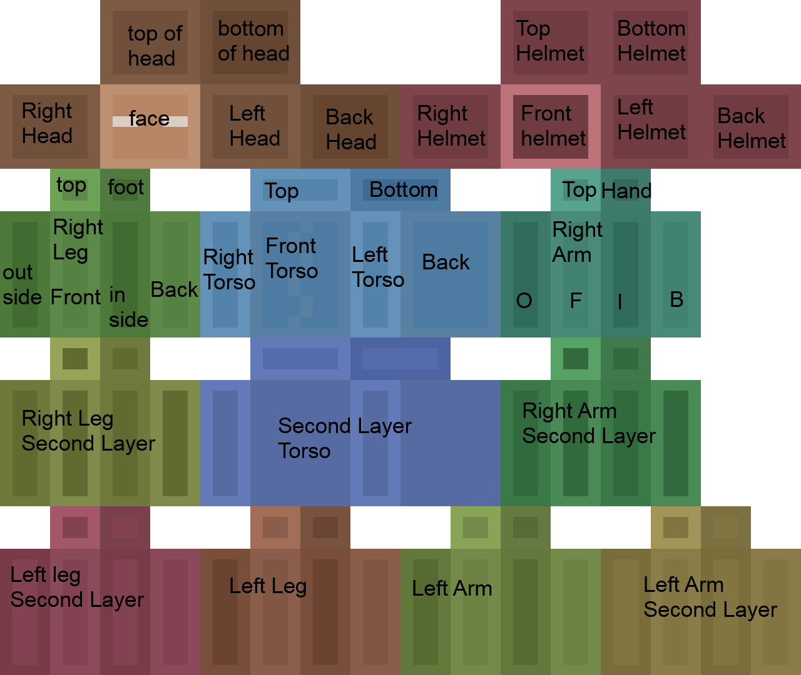

# Minecraft Skin Generator
### Markus Schüller Perdigón - alu0101130507
A text-to-image AI that generates Minecraft skins.  
Using lucidrain's [dalle-pytorch](https://github.com/lucidrains/DALLE-pytorch).

## Dataset
The dataset is stored in the `dataset/` folder and it contains two versions of the dataset, which was scraped from [minecraftskins.net](https://minecraftskins.net/):
* MCSNet: A dataset of pairs of Minecraft skins and its corresponding captions.
* MCSNetVAE: The same skins as MCSNet, but separated into categories for the VAE training. Each category has its own caption, which was used to add more captions more automatically to the MCSNet dataset via a script.

This skins are basically texture images for Minecraft players and are mapped the following way:


The second layer are optional fields for each body part, and as such can be transparent or opaque.
Here's an example of a Minecraft skin with all of the body parts (they are mandatory) and some optional second layers:


## Model
In order to generate the skins, first the VAE and DALLE models must be downloaded from [Google Drive](https://drive.google.com/file/d/19DTefjguy_OVN98J-e6okLWxCdc5C9Ic/view?usp=sharing). By default the models must be placed in a folder called `models/`.  

## Viewer
The viewer is a web application in the folder `viewer/` that allows you to view the generated skins. The skins to be viewed are stored in the `viewer/skins/` folder and must be named `<id>.png`, where id is a number from 0 to 63. It also must have a `caption.txt` file with the caption for that generation of skins.  
To start the viewer, run the following command:
```
python viewer/app.py
```
And then open the browser and navigate to http://localhost:8080/viewer/source/

## Scripts
Under the `scripts/` folder are also some scripts that were used when building the dataset:
* `scrape_MCSNet_dataset.py`: Scrapes the MCSNet dataset from [minecraftskins.net](https://minecraftskins.net/).
* `reformat_skins.py`: Some skins had different formats, some where 64x32 (old format) and some 64x64. This script formats the skins to 64x64.
* `add_category_captions.py`: This script adds captions to the MCSNet dataset according to the category of each skin.

Also there are other scripts that will be used when running the main program:
* `generate.py`: Defines the function `generate(text)` that generate the skins according to the input text.
* `postprocess.py`: Defines the function `postprocess(skin_dir)` that postprocesses the generated skins in the specified directory. 

The postprocessing is done by the following steps:
1. Clear the zones that are supposed to be always empty.
2. Remove the transparency from the body, since it's supposed to be always opaque.
3. Setting either full transparency or full opacity in the second layers of the skin.

## Usage
The easiest way to generate skins is to use the `main.py` script. It takes the following arguments:

```
usage: main.py [-h] [--dalle DALLE] [--no_viewer] --text TEXT

Generate and postprocess skins.

optional arguments:
  -h, --help     show this help message and exit
  --dalle DALLE  The path to dalle.pt
  --no_viewer    Doesn't open the viewer app.
  --text TEXT    The text prompt
```

This script will generate the skins according to the input text, postprocess them and open the viewer app in case `no_viewer` is not set.